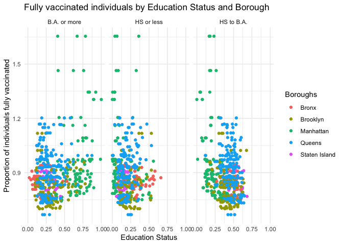
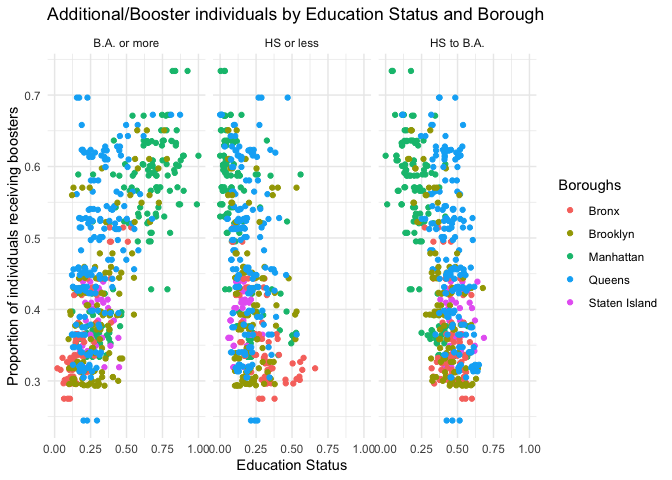

Education Data Pre-Processing + Exploration
================
Pooja Desai (pmd2137)
12/5/2022

    ## 
    ## Attaching package: 'dplyr'

    ## The following objects are masked from 'package:stats':
    ## 
    ##     filter, lag

    ## The following objects are masked from 'package:base':
    ## 
    ##     intersect, setdiff, setequal, union

    ## ── Attaching packages ─────────────────────────────────────── tidyverse 1.3.2 ──
    ## ✔ ggplot2 3.4.0     ✔ purrr   0.3.5
    ## ✔ tibble  3.1.8     ✔ stringr 1.5.0
    ## ✔ tidyr   1.2.1     ✔ forcats 0.5.2
    ## ✔ readr   2.1.3     
    ## ── Conflicts ────────────────────────────────────────── tidyverse_conflicts() ──
    ## ✖ dplyr::filter() masks stats::filter()
    ## ✖ dplyr::lag()    masks stats::lag()

``` r
data <- read.csv("data/census_data/edu_attainment.csv", skip = 1) %>%
  janitor::clean_names() %>%
  mutate(
    edu_pop_total = total_pop_18_24 + total_pop_25 + total_pop_65,
    edu_pop_me = me_pop_18_24 + me_total_pop_25 + me_pop_65, 
    edu_pop_under65_total = total_pop_18_24 + (total_pop_25 - total_pop_65),
    edu_pop_under65_me = me_pop_18_24 + (me_total_pop_25 - me_pop_65),
    
    #regroup 18-24 into edu categories
    total_hs.under_18_24 = total_less_hs12_18_24 + total_hs_18_24,
    total_hs.to.ba_18_24 = total_some_col_18_24,
    total_ba.over_18_24 = total_col_18_24,
    
    #regroup 25+ into edu categories
    total_hs.under_25.over = total_pop_25 - total_over_hs_25,
    total_hs.to.ba_25.over = total_over_hs_25 - total_ba_over_25,
    total_ba.over_25.over = total_ba_over_25,
    
    #regroup 65+ into edu categories
    hs.under_65.over = total_pop_65 - total_over_hs_65,
    hs.to.ba_65.over= total_over_hs_65 - total_ba_over_65,
    ba.over_65.over = total_ba_over_65,
    
    #calculate under 65, into edu categories
    hs.under_under.65 = total_hs.under_18_24 + (total_hs.under_25.over - hs.under_65.over),
    hs.to.ba_under.65 = total_hs.to.ba_18_24 + (total_hs.to.ba_25.over - hs.to.ba_65.over),
    ba.over_under.65 = total_ba.over_18_24 + (total_ba.over_25.over - ba.over_65.over),
    modzcta = substr(zcta_zip,6,11)) %>% #extract ZCTA zipcode
  select(
    modzcta, edu_pop_total, edu_pop_under65_total, total_pop_65,
    hs.under_under.65, hs.to.ba_under.65, ba.over_under.65,
    hs.under_65.over, hs.to.ba_65.over, ba.over_65.over) -> dataset_clean #export truncated dataset
```

Population buckets: total population (18+) // under 65 population
(18-65) // over 65 population (65+)

Educational bucket:

| EDU // AGE bucket   | 18-24                                   | 25+                                 | 65+                                 |
|---------------------|-----------------------------------------|-------------------------------------|-------------------------------------|
| HS (GED) or less    | total_less_hs_12_18_24 + total_hs_18_24 | total_pop_25 - total_over_hs_25     | total_pop_65 - total_over_hs_65     |
| btwn HS and college | total_some_col_18_24                    | total_over_hs_25 - total_ba_over_25 | total_over_hs_65 - total_over_ba_65 |
| 4 yr degree +       | total_col_18_24                         | total_over_ba_25                    | total_over_ba_65                    |

``` r
#read in booster data
vaccine_data <- read.csv("data/coverage-by-modzcta-adults_03.09.22.csv") %>% 
  janitor::clean_names() %>%
  mutate(modzcta = as.character(modzcta))

vaccine_data$modzcta <- gsub('\\s+', '', vaccine_data$modzcta)
dataset_clean$modzcta <- gsub('\\s+', '', dataset_clean$modzcta)
```

``` r
#merge booster and edu
joined_dataset_education = merge(vaccine_data,dataset_clean, by = "modzcta", all.x = TRUE)
```

``` r
#tidy dataset
joined_dataset_education %>%
  mutate(
    hs.under_total = hs.under_under.65 + hs.under_65.over,
    hs.to.ba_total = hs.to.ba_under.65 + hs.to.ba_65.over,
    ba.over_total = ba.over_under.65 + ba.over_65.over) %>%
  
  pivot_longer(c("hs.under_under.65", "hs.to.ba_under.65","ba.over_under.65", 
                 "hs.under_65.over", "hs.to.ba_65.over","ba.over_65.over",
                 "hs.under_total","hs.to.ba_total", "ba.over_total"), 
               names_to = "age_edu_label", 
               values_to = "edu_count") %>%
  
  separate(col=age_edu_label, into=c("edu","age"), sep="_", convert = TRUE) %>%
  mutate(edu = recode(edu, "hs.under" = "HS or less", 
                      "hs.to.ba" = "HS to B.A.", "ba.over" = "B.A. or more"),
    edu = factor(edu),
    age = recode(age, "under.65" = "under 65", "65.over" = "65 +"),
    age = factor(age),
    borough = factor(borough),
    count_age_edu = ifelse(age == "total", edu_pop_total, 
                       ifelse(age == "under 65",edu_pop_under65_total,total_pop_65)),
    edu_prop = edu_count/count_age_edu,
    partially_vaccinated_prop = count_partially_cumulative/pop_denominator,
    fully_vaccinated_prop = count_fully_cumulative/pop_denominator,
    booster_prop = count_additional_cumulative/pop_denominator) %>%

    select(borough, modzcta, neighborhood_name, pop_denominator, count_age_edu,
           edu_count, edu, age, partially_vaccinated_prop,
           fully_vaccinated_prop, booster_prop, edu_prop) -> edu_booster_dataset

write.csv(edu_booster_dataset, "cleaned_edu_booster_dataset.csv", row.names=FALSE)
```

## Plots for EDA

``` r
edu_booster_dataset[edu_booster_dataset$age=="total",]
```

    ## # A tibble: 531 × 12
    ##    borough   modzcta neigh…¹ pop_d…² count…³ edu_c…⁴ edu   age   parti…⁵ fully…⁶
    ##    <fct>     <chr>   <chr>     <dbl>   <int>   <int> <fct> <fct>   <dbl>   <dbl>
    ##  1 Manhattan 10001   Chelse…  25537.   25443    2287 HS o… total   0.322   1.20 
    ##  2 Manhattan 10001   Chelse…  25537.   25443    4849 HS t… total   0.322   1.20 
    ##  3 Manhattan 10001   Chelse…  25537.   25443   15143 B.A.… total   0.322   1.20 
    ##  4 Manhattan 10002   Chinat…  63973.   82281   21506 HS o… total   0.116   0.963
    ##  5 Manhattan 10002   Chinat…  63973.   82281   21116 HS t… total   0.116   0.963
    ##  6 Manhattan 10002   Chinat…  63973.   82281   22008 B.A.… total   0.116   0.963
    ##  7 Manhattan 10003   East V…  50399.   57672    5231 HS o… total   0.132   0.774
    ##  8 Manhattan 10003   East V…  50399.   57672   12170 HS t… total   0.132   0.774
    ##  9 Manhattan 10003   East V…  50399.   57672   33347 B.A.… total   0.132   0.774
    ## 10 Manhattan 10004   Financ…   2685.    3344      94 HS o… total   0.267   1.34 
    ## # … with 521 more rows, 2 more variables: booster_prop <dbl>, edu_prop <dbl>,
    ## #   and abbreviated variable names ¹​neighborhood_name, ²​pop_denominator,
    ## #   ³​count_age_edu, ⁴​edu_count, ⁵​partially_vaccinated_prop,
    ## #   ⁶​fully_vaccinated_prop

``` r
p <- ggplot(data = edu_booster_dataset[edu_booster_dataset$age=="total",],
            aes(x = edu_prop, y = booster_prop, color = edu))
p + geom_point() + facet_grid(~ age) +
  labs(
    xlab = "proportion of ZIP educated"
  )
```

<!-- -->

``` r
m <- ggplot(data = edu_booster_dataset[edu_booster_dataset$age=="total",], 
            aes(x = edu_prop, y = fully_vaccinated_prop, color = edu))
m + geom_point()
```

<!-- -->
