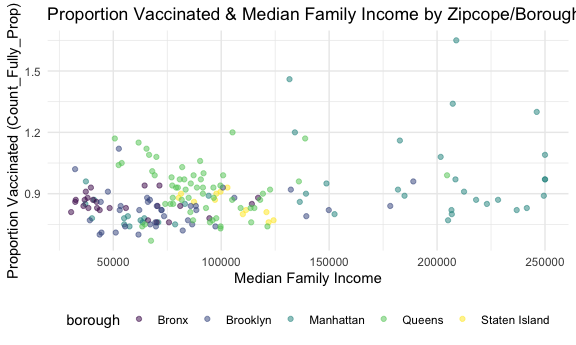
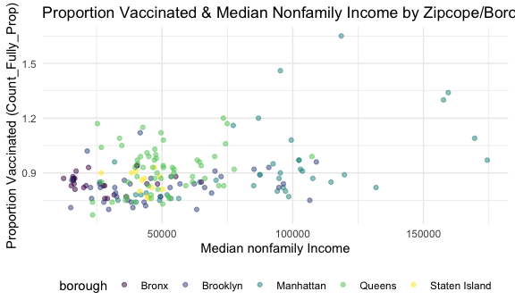
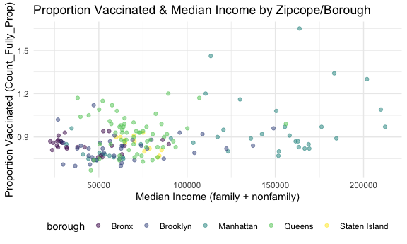
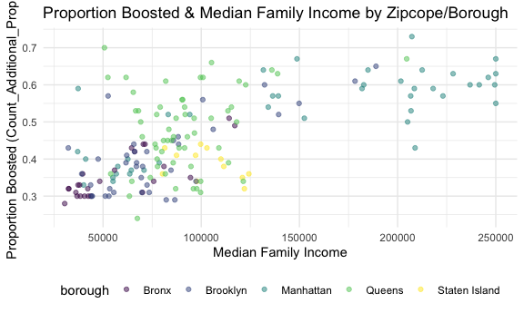
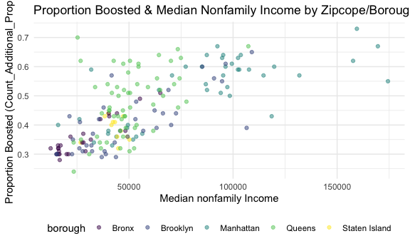
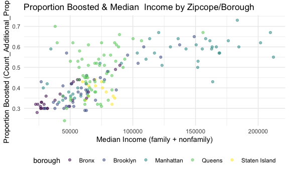

Income Data Pre-Processing + Exploration
================
Sabah Usmani (su2145)
2022-12-09

    ## 
    ## Attaching package: 'dplyr'

    ## The following objects are masked from 'package:stats':
    ## 
    ##     filter, lag

    ## The following objects are masked from 'package:base':
    ## 
    ##     intersect, setdiff, setequal, union

    ## ── Attaching packages ─────────────────────────────────────── tidyverse 1.3.2 ──
    ## ✔ ggplot2 3.3.6     ✔ purrr   0.3.4
    ## ✔ tibble  3.1.8     ✔ stringr 1.4.1
    ## ✔ tidyr   1.2.0     ✔ forcats 0.5.2
    ## ✔ readr   2.1.2     
    ## ── Conflicts ────────────────────────────────────────── tidyverse_conflicts() ──
    ## ✖ dplyr::filter() masks stats::filter()
    ## ✖ dplyr::lag()    masks stats::lag()

``` r
#Loading income data 
incomedata <- read_csv("data/census_data/median_income.csv", skip = 1)
```

    ## New names:
    ## Rows: 1794 Columns: 483
    ## ── Column specification
    ## ──────────────────────────────────────────────────────── Delimiter: "," chr
    ## (396): Geography, Geographic Area Name, Annotation of Estimate!!Number!!... dbl
    ## (86): Estimate!!Number!!HOUSEHOLD INCOME BY RACE AND HISPANIC OR LATINO... lgl
    ## (1): ...483
    ## ℹ Use `spec()` to retrieve the full column specification for this data. ℹ
    ## Specify the column types or set `show_col_types = FALSE` to quiet this message.
    ## • `` -> `...483`

``` r
#Loading zipcode data 
zipcode_data <- read.csv("data/Modified_Zip_Code_Tabulation_Areas__MODZCTA_.csv")

incomedata_clean <- incomedata %>%  
  janitor::clean_names()  %>%
  select(geography, geographic_area_name, estimate_median_income_dollars_families_families, estimate_median_income_dollars_nonfamily_households_nonfamily_households) %>%
  rename (median_income_nonfamily = estimate_median_income_dollars_nonfamily_households_nonfamily_households, median_income_family = estimate_median_income_dollars_families_families) %>% 
  separate(geographic_area_name, c('delete', 'modzcta')) %>% 
  select(modzcta, median_income_family, median_income_nonfamily)

vaccine_data <- read.csv("data/coverage-by-modzcta-adults_03.09.22.csv") %>%
  janitor::clean_names() %>%
  mutate(modzcta = as.character(modzcta))

vaccine_data$modzcta <- gsub('\\s+', '', vaccine_data$modzcta)
```

``` r
joined_dataset_income = merge(vaccine_data,incomedata_clean, by = "modzcta", all.x = TRUE)
```

``` r
#Cleaning variables in joined data and changing into the correct variable type 

income_zip_clean <- joined_dataset_income %>%
  mutate(modzcta = as.numeric(modzcta), median_fam = as.numeric(median_income_family), median_nonfam = as.numeric(median_income_nonfamily)) %>% 
  mutate(median_fam = if_else(is.na(median_fam), 250000, median_fam)) %>% 
  filter(!is.na(median_nonfam)) %>% 
  select(modzcta, pop_denominator, count_partially_cumulative, count_fully_cumulative, count_1plus_cumulative, count_additional_cumulative, median_fam, median_nonfam, borough) %>% 
  mutate(Count_partially_prop = round(count_partially_cumulative/pop_denominator,2), Count_Fully_prop = round(count_fully_cumulative/pop_denominator,2), Count_1Plus_prop = round(count_1plus_cumulative/pop_denominator,2), Count_Additional_prop = round(count_additional_cumulative/pop_denominator,2), income_average = ((median_fam + median_nonfam)/2))
```

    ## Warning in mask$eval_all_mutate(quo): NAs introduced by coercion

    ## Warning in mask$eval_all_mutate(quo): NAs introduced by coercion

``` r
str(income_zip_clean)
```

    ## 'data.frame':    175 obs. of  14 variables:
    ##  $ modzcta                    : num  10001 10002 10003 10004 10005 ...
    ##  $ pop_denominator            : num  25537 63973 50399 2685 8170 ...
    ##  $ count_partially_cumulative : int  8231 7419 6675 718 1542 988 1141 5466 3452 5415 ...
    ##  $ count_fully_cumulative     : int  30761 61628 39005 3611 7956 4116 6085 43065 24397 39059 ...
    ##  $ count_1plus_cumulative     : int  38992 69047 45680 4329 9498 5104 7226 48531 27849 44474 ...
    ##  $ count_additional_cumulative: int  13862 37670 24957 1970 4469 1941 3747 26324 16380 26483 ...
    ##  $ median_fam                 : num  134134 37313 205083 207272 250000 ...
    ##  $ median_nonfam              : num  86899 31832 98435 159482 174408 ...
    ##  $ borough                    : chr  "Manhattan" "Manhattan" "Manhattan" "Manhattan" ...
    ##  $ Count_partially_prop       : num  0.32 0.12 0.13 0.27 0.19 0.31 0.2 0.11 0.11 0.12 ...
    ##  $ Count_Fully_prop           : num  1.2 0.96 0.77 1.34 0.97 1.3 1.09 0.85 0.8 0.87 ...
    ##  $ Count_1Plus_prop           : num  1.53 1.08 0.91 1.61 1.16 1.62 1.3 0.96 0.91 0.99 ...
    ##  $ Count_Additional_prop      : num  0.54 0.59 0.5 0.73 0.55 0.62 0.67 0.52 0.53 0.59 ...
    ##  $ income_average             : num  110516 34572 151759 183377 212204 ...

``` r
#GGPLOT of Vaccination and family median income and non family median income by borough

income_zip_clean %>%
    ggplot() +
    geom_point(aes(x = median_fam, y=Count_Fully_prop, color=borough), alpha = 0.5)+
  labs(
   title = "Proportion Vaccinated & Median Family Income by Zipcope/Borough", 
    x = "Median Family Income", 
    y = "Proportion Vaccinated (Count_Fully_Prop)")
```



``` r
#GGPLOT of Vaccination and nonfamily median income and non family median income by borough
income_zip_clean %>%
    ggplot() +
    geom_point(aes(x = median_nonfam, y=Count_Fully_prop, color=borough), alpha = 0.5)+
  labs(
   title = "Proportion Vaccinated & Median Nonfamily Income by Zipcope/Borough", 
    x = "Median nonfamily Income", 
    y = "Proportion Vaccinated (Count_Fully_Prop)")
```



``` r
#GGPLOT of Vaccination combined median income and non family median income by borough

income_zip_clean %>%
    ggplot() +
    geom_point(aes(x = income_average, y=Count_Fully_prop, color=borough), alpha = 0.5)+
  labs(
   title = "Proportion Vaccinated & Median Income by Zipcope/Borough", 
    x = "Median Income (family + nonfamily)", 
    y = "Proportion Vaccinated (Count_Fully_Prop)")
```



``` r
#GGPLOT OF BOOSTER STATUS AND MEDIAN INCOME 
income_zip_clean %>%
    ggplot() +
    geom_point(aes(x = median_fam, y=Count_Additional_prop, color=borough), alpha = 0.5)+
  labs(
   title = "Proportion Boosted & Median Family Income by Zipcope/Borough", 
    x = "Median Family Income", 
    y = "Proportion Boosted (Count_Additional_Prop)")
```



``` r
income_zip_clean %>%
    ggplot() +
    geom_point(aes(x = median_nonfam, y=Count_Additional_prop, color=borough), alpha = 0.5)+
  labs(
   title = "Proportion Boosted & Median Nonfamily Income by Zipcope/Borough", 
    x = "Median nonfamily Income", 
    y = "Proportion Boosted (Count_Additional_Prop)")
```



``` r
income_zip_clean %>%
    ggplot() +
    geom_point(aes(x = income_average, y=Count_Additional_prop, color=borough), alpha = 0.5)+
  labs(
   title = "Proportion Boosted & Median  Income by Zipcope/Borough", 
    x = "Median Income (family + nonfamily)", 
    y = "Proportion Boosted (Count_Additional_Prop)")
```


