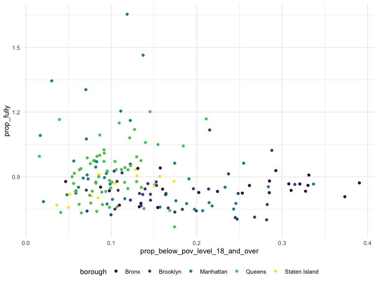
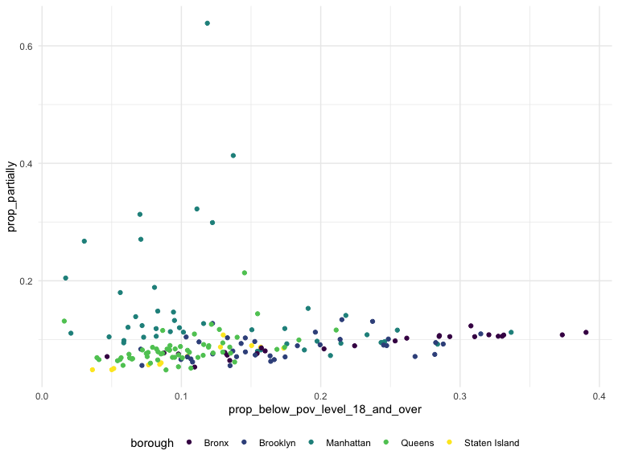
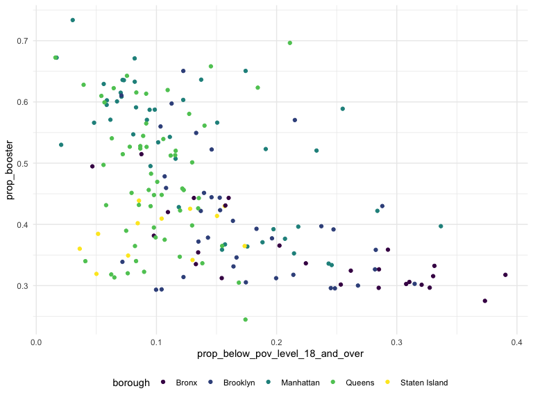
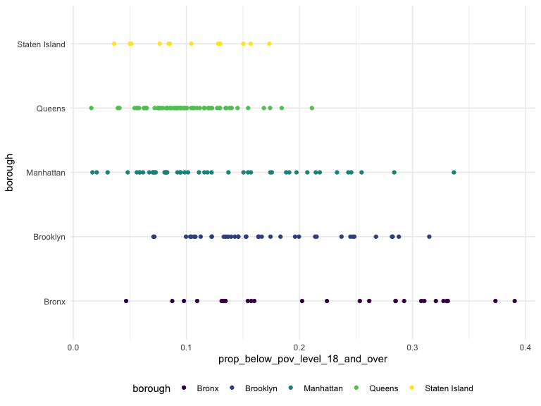

Poverty Data Pre-Processing + Exploration
================
Brittany Shea
2022-12-09

    ## 
    ## Attaching package: 'dplyr'

    ## The following objects are masked from 'package:stats':
    ## 
    ##     filter, lag

    ## The following objects are masked from 'package:base':
    ## 
    ##     intersect, setdiff, setequal, union

    ## ── Attaching packages ─────────────────────────────────────── tidyverse 1.3.2 ──
    ## ✔ ggplot2 3.3.6     ✔ purrr   0.3.4
    ## ✔ tibble  3.1.8     ✔ stringr 1.4.1
    ## ✔ tidyr   1.2.0     ✔ forcats 0.5.2
    ## ✔ readr   2.1.2     
    ## ── Conflicts ────────────────────────────────────────── tidyverse_conflicts() ──
    ## ✖ dplyr::filter() masks stats::filter()
    ## ✖ dplyr::lag()    masks stats::lag()
    ## Loading required package: viridisLite

### Load and clean poverty data; select data relevant for 18+

``` r
data <- read.csv("data/census_data/poverty_status.csv", skip = 1) %>%
  janitor::clean_names()

dataset_clean = data %>% 
  mutate(modzcta = substr(geographic_area_name,6,11),
         total_pop_pov_det_18_and_over = estimate_total_population_for_whom_poverty_status_is_determined - estimate_total_population_for_whom_poverty_status_is_determined_age_under_18_years) %>% 
  mutate(below_pov_level_pop_pov_det_18_and_over = estimate_below_poverty_level_population_for_whom_poverty_status_is_determined - estimate_below_poverty_level_population_for_whom_poverty_status_is_determined_age_under_18_years) %>%
  select(modzcta, total_pop_pov_det_18_and_over, below_pov_level_pop_pov_det_18_and_over)
```

### Divide “status determined” by “below poverty level” to find proportion

``` r
dataset_clean = dataset_clean %>% 
  mutate(prop_below_pov_level_18_and_over = below_pov_level_pop_pov_det_18_and_over / total_pop_pov_det_18_and_over)
```

### Load zipcode data

``` r
zipcode_data <- read.csv("data/Modified_Zip_Code_Tabulation_Areas__MODZCTA_.csv")
```

### Load and clean vaccine data

``` r
vaccine_data <- read.csv("data/coverage-by-modzcta-adults_03.09.22.csv") %>%
  janitor::clean_names() %>%
  mutate(modzcta = as.character(modzcta))

vaccine_data$modzcta <- gsub('\\s+', '', vaccine_data$modzcta)
dataset_clean$modzcta <- gsub('\\s+', '', dataset_clean$modzcta)
```

### Join data

``` r
joined_dataset_poverty = merge(vaccine_data,dataset_clean, by = "modzcta", all.x = TRUE)
```

### Create proportions for vaccine data

``` r
joined_dataset_poverty = joined_dataset_poverty %>% 
  mutate(
  prop_partially = count_partially_cumulative / pop_denominator,
    prop_fully = count_fully_cumulative / pop_denominator,
    prop_booster = count_additional_cumulative / pop_denominator
  )
```

### Plots

# Fully vaccinated:

``` r
joined_dataset_poverty %>% 
  ggplot(aes(x = prop_below_pov_level_18_and_over, y = prop_fully, color = borough)) +
  geom_point()
```



# Partially vaccinated:

``` r
joined_dataset_poverty %>% 
  ggplot(aes(x = prop_below_pov_level_18_and_over, y = prop_partially, color = borough)) +
  geom_point()
```



# Booster:

``` r
joined_dataset_poverty %>% 
  ggplot(aes(x = prop_below_pov_level_18_and_over, y = prop_booster, color = borough)) +
  geom_point()
```



# Zipcode and variable:

``` r
joined_dataset_poverty %>% 
  ggplot(aes(x = prop_below_pov_level_18_and_over, y = borough, color = borough)) +
  geom_point()
```


